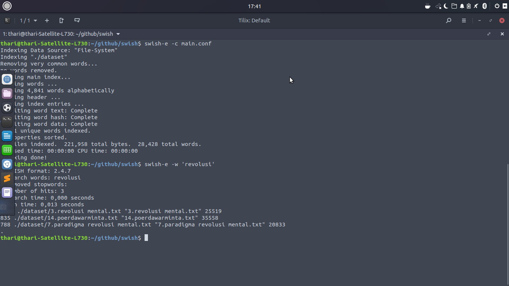
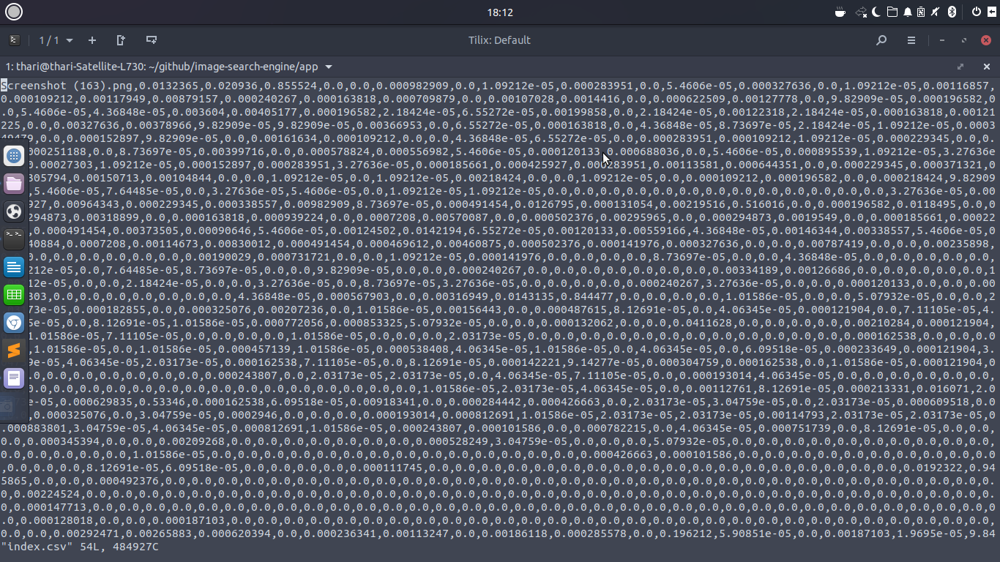

# tugas1rdm_indexing
1. Text indexing :

- Install swish e : jalankan di terminal linux anda : sudo apt-get install swish-e
- untuk masuk ke dalam folder swish menggunakan cd ./swish
- kemudian jalankan progam 
- swish-e -c main.conf
- untuk mencari salah satu kata dari hasil indexing gunakan syntax 
- swish-e -w 'kata yang ingin dicari' 
- misalnya : swish-e -w 'revolusi'

2. image indexing

- install PIP : sudo apt install python3-pip
- untuk menginstall modul pytho : pip install -r requirements.txt
- Masuk ke folder image indexing : cd ./image-indexing

- masuk ke folder app : cd ./app
- jalankan program nya dengan menuliskan di terminal : python index.py --dataset static/images --index index.csv

-output 

- sumber :

- text indexing : [swish-e](https://www.esa.org/tiee/search/html/install.html)
- image indexing : [image-search-engine](https://github.com/kudeh/image-search-engine)
